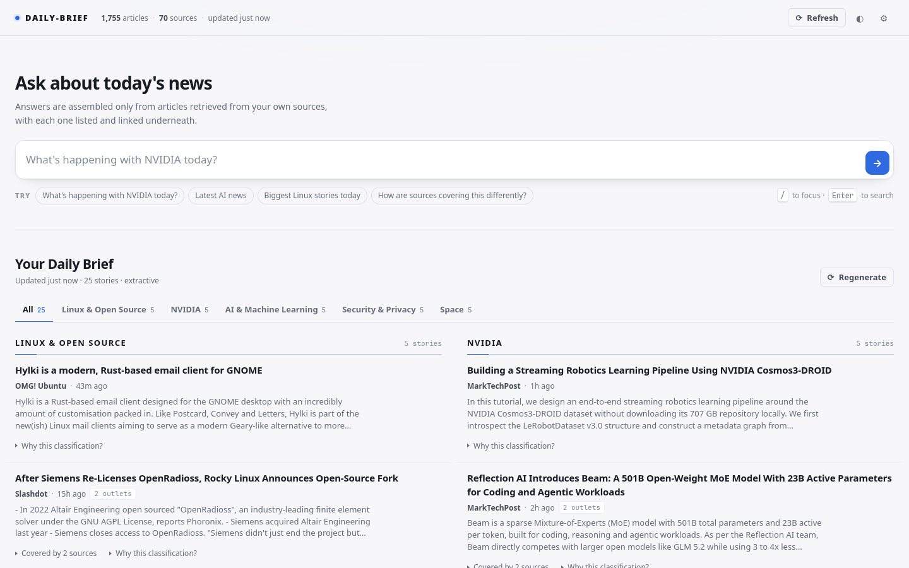
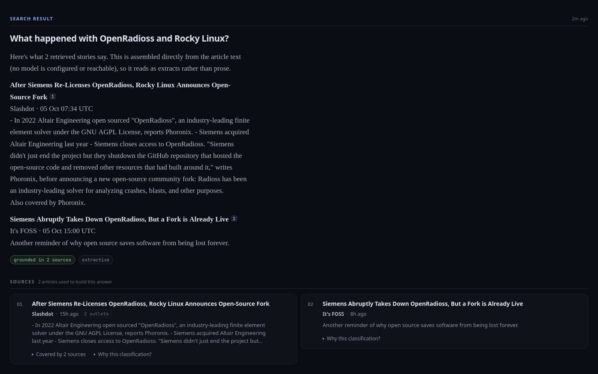
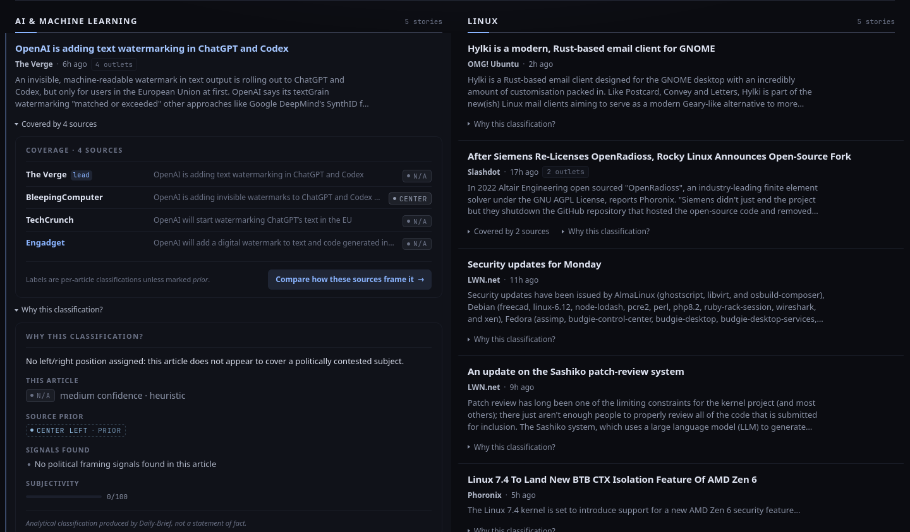

# Daily-Brief

A self-hosted, bias-aware personal news briefing and news research application.

Two things, clearly separated:

* **Ask about the news** (top) — natural-language questions answered *only* from
  articles actually retrieved from your sources, with citations.
* **Your Daily Brief** (bottom) — a personalised briefing generated from your
  own free-text interests.

It runs entirely on your machine. It works with a local LLM (Ollama, llama.cpp,
vLLM, LM Studio — anything OpenAI-compatible) and it also works with **no model
at all**, falling back to a deterministic extractive engine that can only quote
sentences that exist in retrieved articles.


<picture>
  <source media="(prefers-color-scheme: dark)" srcset="docs/screenshots/briefing-dark.png">
  
</picture>

<table>
  <tr>
    <td width="50%"></td>
    <td width="50%"></td>
  </tr>
  <tr>
    <td align="center"><sub>A grounded answer: every sentence comes from a cited article</sub></td>
    <td align="center"><sub>Cross-outlet coverage and the evidence behind each label</sub></td>
  </tr>
</table>

---

## 1. Architecture overview

```
                    ┌──────────────────────────────────────────┐
   browser ────────▶│  FastAPI  ·  JSON API + static frontend   │
                    └────────────────────┬─────────────────────┘
   CLI ─────────────────────────────────▶│
                                         ▼
                            ┌────────────────────────┐
                            │  Application (service) │  wiring + lifecycle
                            └───┬───────────┬────────┘
             ┌──────────────────┘           └──────────────────┐
             ▼                                                 ▼
   ┌───────────────────┐                            ┌────────────────────┐
   │  News pipeline    │                            │  Search service    │
   │  fetch → parse →  │                            │  understand →      │
   │  normalize →      │                            │  retrieve →        │
   │  dedupe →         │                            │  select → ground → │
   │  classify →       │                            │  generate → cite   │
   │  bias → store     │                            └─────────┬──────────┘
   └─────────┬─────────┘                                      │
             │              ┌────────────────────┐            │
             ├─────────────▶│ Briefing generator │◀───────────┤
             │              └────────────────────┘            │
             ▼                        ▼                       ▼
   ┌─────────────────────────────────────────────────────────────────┐
   │  SQLite + FTS5   (articles, clusters, prefs, briefings, chats)   │
   └─────────────────────────────────────────────────────────────────┘
                                     ▲
                            ┌────────┴─────────┐
                            │  LLM provider    │  OpenAI-compatible, or none
                            └──────────────────┘
```

One process. One file of state. No broker, no container orchestration, no
external services. `APScheduler` runs the periodic jobs inside the same event
loop as the web server.

---

## 2. Technology choices and rationale

| Choice | Why |
| --- | --- |
| **Python 3.11+** | Standard library covers XML, SQLite, TOML and HTTP well; ecosystem for feeds and async I/O is mature. |
| **FastAPI + Uvicorn** | Small, async, self-documenting (`/docs`). The API surface is ~12 routes; a heavier framework would be overhead. |
| **SQLite + FTS5** | The dataset is a few thousand short documents on one machine. SQLite is in the stdlib, needs no server, is ACID, and FTS5 gives a real BM25 index — exactly the retrieval primitive needed. Postgres would be infrastructure for its own sake. |
| **Hand-written feed parser** (`xml.etree`) | RSS/Atom/RDF are simple. Rolling it ourselves means malformed feeds are handled the way this app wants — salvage what parses, skip what doesn't, never raise into the ingest loop — and removes a dependency. |
| **httpx** | Async, HTTP/2, conditional GET. Lets 70+ feeds be fetched concurrently in ~6s. |
| **Vanilla HTML/CSS/JS frontend** | No build step, no `node_modules`, no lockfile to rot. `git clone` and run. The UI is a reading surface, which plain DOM handles well. |
| **APScheduler in-process** | One user, one machine. Cron/systemd timers are also supported via the CLI, so the scheduler can be turned off entirely. |
| **Provider-agnostic LLM layer** | Any OpenAI-compatible endpoint. Model choice is *configuration*, never code. A `NullProvider` makes "no model" a first-class, fully-supported mode. |
| **Lexical retrieval (BM25 + entities + recency), no embeddings** | Queries are entity-heavy ("NVIDIA", "OpenAI", "Strait of Hormuz") over a rolling window of short headlines. BM25 over titles plus extracted proper nouns is strong here, instant, and avoids a multi-hundred-MB torch/sentence-transformers dependency. `Retriever` is a single seam if a dense stage is wanted later. |
| **Heuristic bias analysis** | Explainable and inspectable. Every label ships with the evidence that produced it. An opaque classifier would be worse for a feature whose entire point is helping the user judge framing. |

---

## 3. Project structure

```
daily-brief/
├── config/
│   ├── config.toml            system configuration (host/port, model, intervals…)
│   └── sources.yaml           source registry + per-publication bias metadata
├── daily_brief/
│   ├── config.py              layered config: defaults → TOML → env
│   ├── logging_setup.py
│   ├── models.py              domain dataclasses (Article, Source, BiasAssessment…)
│   ├── db.py                  SQLite connection + migrations
│   ├── repository.py          all SQL lives here
│   ├── preferences.py         user personalization (separate from system config)
│   ├── text.py                tokenizing, folding, simhash, term matching
│   ├── service.py             Application container — the wiring
│   ├── scheduler.py           background refresh + daily briefing jobs
│   ├── cli.py                 run / refresh / generate / brief / search / configure …
│   ├── news/
│   │   ├── sources.py         registry loading
│   │   ├── feeds.py           conditional-GET fetching
│   │   ├── parser.py          RSS 2.0 / Atom / RDF → raw entries
│   │   ├── normalize.py       raw entries → Article, URL canonicalization
│   │   ├── dedupe.py          exact / near dedup + story clustering
│   │   └── ingest.py          pipeline orchestration
│   ├── analysis/
│   │   ├── topics.py          topic lexicon + classifier
│   │   ├── relevance.py       free-text interest parsing + scoring
│   │   ├── bias.py            article-level framing analysis, coverage comparison
│   │   └── summarize.py       extractive summarization
│   ├── llm/
│   │   ├── base.py            provider interface
│   │   ├── openai_compat.py   Ollama / llama.cpp / vLLM / LM Studio / …
│   │   ├── null.py            the no-model provider
│   │   ├── factory.py
│   │   └── prompts.py         the grounding contract
│   ├── search/
│   │   ├── query.py           query understanding
│   │   ├── retriever.py       hybrid retrieval + re-ranking + diversity
│   │   ├── answer.py          grounded generation + citation validation
│   │   └── chat.py            session/context management
│   ├── briefing/generator.py  personalised briefing
│   └── api/                   FastAPI app + schemas
├── web/                       index.html, app.js, styles.css
└── tests/                     291 tests
```

---

## 4. Data model

SQLite, migrated by `PRAGMA user_version`.

| Table | Purpose |
| --- | --- |
| `sources` | Registry snapshot: id, name, url, categories, **lean**, **confidence**, source_type, country, ownership, notes. |
| `feed_state` | Per-feed ETag / Last-Modified / last success / consecutive failures (backoff). |
| `articles` | canonical_url (unique), url, title, source, summary, content, author, **published_at**, **retrieved_at**, language, image, feed_categories, **topics** (JSON), **entities** (JSON), **bias** (JSON), content_hash, simhash, cluster_id. |
| `articles_fts` | FTS5 external-content index over title/summary/content/entities/topics, weighted toward titles. |
| `clusters` | Story groups (same event, multiple outlets). |
| `preferences` | Single row, open JSON document. |
| `briefings` | Generated briefings, retained for history. |
| `chat_sessions` / `chat_messages` | Conversation context and per-answer source attribution. |

**Extensibility.** The open-ended parts (`topics`, `entities`, `bias`,
`preferences.extras`) are JSON, so new metadata — additional bias dimensions,
per-source preferences, geographic focus — can be added without a migration.
`BiasAssessment` is a versioned structure carrying `method` and `signals`, so an
LLM- or model-based analyser can be introduced alongside the heuristic one.

---

## 5. News retrieval pipeline

```
sources.yaml
   → conditional GET (ETag / If-Modified-Since, 8 concurrent)
   → parse (RSS 2.0 / Atom / RDF; malformed input salvaged or skipped)
   → normalize (canonical URL, HTML stripped, entities extracted, hashes)
   → dedupe exact  (canonical URL / content hash)
   → dedupe near   (SimHash + token containment, same source only)
   → topic classification
   → bias / framing analysis
   → store
   → cluster (union-find over headline + entity overlap in a time window)
   → prune beyond the retention horizon
```

Design points:

* **Sources are data.** No module references any publication. Adding one is a
  YAML edit.
* **Failure is per-source.** A dead feed produces a failed result, not an
  exception; after N consecutive failures it is paused until it recovers.
* **Cross-source duplicates are not deleted.** Independent coverage of the same
  story is the signal the product needs, so it is *clustered* and surfaced as
  "also covered by …", while each story still occupies one slot.

Measured on the shipped registry: **72/72 feeds, 1,815 articles, 45 story
clusters, in ~6 seconds.**

---

## 6. Personalization / onboarding flow

First run detects `onboarded = false` and shows one question: *"What are you
interested in?"* — free text, not a category picker.

```
"AI, Linux, gaming, NVIDIA, geopolitics, US politics
 and interesting things happening in India"
        ↓  parse_interests()
   split → strip conversational filler → map to canonical topics where possible
        ↓
AI & Machine Learning · Linux & Open Source · Gaming · NVIDIA ·
Geopolitics · US Politics · India
```

Interests that map to a known topic inherit its lexicon; interests that don't
("competitive bonsai cultivation") are kept verbatim as free-text matchers. The
raw text is stored alongside the parsed labels so Settings can show back exactly
what was typed. **No user's interests are hardcoded anywhere.**

---

## 7. Interactive search architecture

```
question
  → understand   deterministic parse (entities, keywords, topics, time window,
                 intent); optionally expanded by the LLM, which is asked ONLY for
                 search terms and whose output is merged, never substituted
  → retrieve     FTS5 BM25, entity-anchored; widened only if nothing is found
  → filter       weighted query-coverage threshold
  → rank         0.32·lexical + 0.22·coverage + 0.20·entity + 0.10·topic
                 + 0.11·recency + 0.05·interest
  → diversify    per-source and per-cluster caps
  → group        fold clusters into stories, attach sibling coverage
  → generate     grounded answer with [n] citations
  → verify       every citation checked against the supplied articles
  → attribute    full metadata returned for each source
```

**Grounding is enforced in three independent layers, because prompting alone is
not a guarantee:**

1. **Structural** — if retrieval returns nothing, the model is *never called*.
   A fixed "no relevant results found" response is returned. There is no code
   path where the model is asked about news with an empty context.
2. **Prompted** — the system prompt states that the ARTICLES block is the only
   permitted source and requires `[n]` citations.
3. **Verified** — citations outside the supplied range are stripped and reported
   to the user; an answer with *no* valid citation is discarded in favour of the
   extractive engine, because it cannot be audited.

Follow-ups work: prior turns influence **retrieval** (resolving "this", "only
the biggest ones") but never supply facts — those always come from articles
retrieved for the current turn.

---

## 8. Daily briefing architecture

```
recent articles (lookback window)
  → score against each interest individually
  → drop everything below the interest threshold
  → group by cluster (one story = one slot, regardless of outlet count)
  → rank  0.50·interest + 0.28·recency + 0.12·substance + 0.10·has-date
          − opinion penalty − first-party penalty
          + corroboration bonus (independent outlets running it)
  → section by BEST-matching interest, falling through if a section is full
  → cap per section, per source, and overall
  → summarize (extractive always; LLM rewrite only if properly cited)
```

It is not a feed dump: an article appears only if it clears the interest
threshold, a story appears once no matter how many outlets ran it, and no single
outlet can fill a section.

---

## 9. Bias / source-analysis approach

Two layers, deliberately kept apart.

**Source prior** (`config/sources.yaml`) — a coarse, publication-level `lean`
with an explicit `confidence`, `source_type`, `country`, `ownership` and a
`notes` field recording the reasoning. The file documents its own methodology
and states plainly that these are analytical classifications, not facts.

**Article-level analysis** (`analysis/bias.py`) — starts from the source prior,
then moves away from it using signals measured in the article itself:

* opinion/commentary markers (section URL, headline prefix, first-person density)
* emotive/evaluative vocabulary density
* headline construction (charged wording, question headlines, scare quotes)
* sourcing quality (named/documentary vs anonymous/hedged attribution)
* balance of partisan references
* structural context (vendor first-party, aggregator, state-funded)

The result carries `lean`, `lean_score`, `confidence`, `subjectivity`,
`is_opinion`, `framing` markers, a `rationale`, and — most importantly — the
`signals` list, which the UI shows behind *"Why this classification?"*.

Crucially, **an article is not assumed to share its publication's framing**: a
piece using strongly right-coded vocabulary in a left-classified outlet moves
right, and the UI says so. Where a left/right axis doesn't apply — a kernel
release, a GPU review — the analyser returns `not-applicable` rather than
inventing a position.

*"How are different sources covering this?"* expands the story's whole cluster,
buckets it by lean, and reports what is measurable: which outlets covered it,
their headlines, framing markers, opinion counts, the lean spread, and the words
that appear in one camp's headlines but not the other's. If the sample is small
or one-sided, it says so instead of manufacturing a disagreement.

---

## 9b. Interface, layout and visual design

The frontend is one HTML file, one stylesheet and one script — no build step, no
framework, no dependencies. Everything visual is derived from a token block at
the top of `web/styles.css`:

| Group | Tokens |
| --- | --- |
| surfaces | `--bg` `--surface` `--surface-elevated` `--surface-hover` `--surface-sunken` |
| borders | `--border-subtle` `--border` `--border-strong` |
| text | `--text` `--text-secondary` `--text-muted` `--text-faint` |
| accent | `--accent` `--accent-strong` `--accent-soft` `--accent-line` `--on-accent` |
| semantic | `--success` `--warning` `--danger` |
| framing scale | `--lean-left` … `--lean-right`, `--lean-state`, `--lean-na` |
| type | `--fs-micro` … `--fs-3xl`, `--lh-tight` `--lh-snug` `--lh-body` |
| space / shape | `--s1` … `--s12`, `--r-xs` … `--r-full`, `--shadow-sm/md/lg` |
| layout | `--content-max` `--gutter` `--measure` `--col-gap` |

Redefining that block is the whole of the light theme (`html[data-theme=light]`),
which is how the theme toggle stays a two-line change rather than a second
stylesheet.

Type carries the hierarchy, not size alone: page heading (21px, 700) → section
heading (13px, 700, uppercase, tracked) → headline (15px, 640) → summary (13px,
muted) → metadata (12px, muted) → evidence (11px, faint). Sections are
*editorial*, not cards — a tracked uppercase category, a rule with a short accent
tick, then stories separated by hairlines. Cards are reserved for things that
genuinely need containment: source evidence under an answer, the coverage panel,
the classification panel, the modals.

### Layout and breakpoints

One container, reused by the header, the ask area, the briefing and the footer:

```css
.wrap { width: min(100% - var(--gutter) * 2, var(--content-max)); margin-inline: auto; }
```

It is wide — but prose inside it is not. Running prose is capped at `--measure`
(68ch ≈ 78 characters) and the dense summaries inside briefing columns at
`--measure-dense` (76ch ≈ 85 characters), so widening the window adds *columns
and density*, not line length. The composer is the deliberate exception: it
spans the container like an address bar, because the text a user types into it
is a query, not a paragraph.

| Viewport | Container | Briefing | Search sources | Notes |
| --- | --- | --- | --- | --- |
| ≥ 1488px | 1440px fixed | 2 columns | 2 columns | comfortable side margins |
| 1100–1487px | window − 48px | 2 columns | 2 columns | ~95% of the window; laptops live here |
| 700–1099px | min(window − 48px, 920px) | 1 column | 1 column | capped so one column of headlines stays readable |
| < 700px | window − 32px | 1 column | 1 column | composer stacks, coverage rows wrap, labels drop |

Measured at 1366×768: the container is 1306px (96% of the window) and each
briefing column is 633px.

Both grids use `minmax(0, 1fr)` rather than `1fr`: a plain `1fr` track has an
`auto` minimum, so one wide item drags its column past its share and squashes the
other. Touch devices (`hover: none`) get enlarged tap targets and lose the hover
tint. `prefers-reduced-motion` disables every animation and transition.

### The two modes

Idle, the page leads with the ask heading, a raised composer and example queries.
Submitting a question adds `body.has-chat`, which shrinks the composer, hides the
examples, moves the heading out of the layout (it stays in the accessibility
tree) and gives the answer the page. `New search` returns to the idle state.

### Story anatomy

```
Senate confirms Todd Blanche as attorney general
Axios · 14h ago · [CENTER-RIGHT] · 11 outlets
The Senate confirmed Todd Blanche as attorney general, despite…
▸ Covered by 11 sources    ▸ Why this classification?
```

Headline links to the publisher; summaries clamp to three lines; everything else
stays behind collapsed disclosures. Hovering tints the row and reveals an accent
rule in the gutter.

Topic tabs above the briefing filter what is already rendered — no round trip.
Selecting one topic spans it across both columns and splits its own stories into
two, so filtering never half-empties the page. Interests with nothing today keep
a disabled `0` tab. The strip scrolls horizontally when it does not fit, and
fades its right edge only while there is more to reveal.

### Coverage and framing

Expanding *Covered by N sources* opens a panel that lists every outlet running
the story with its own classification — one row per outlet, so the list always
matches the count. When the outlets disagree, a proportional strip above the list
shows the spread (`3 left · 2 center · 2 right`). Each row links to that outlet's
article. `Compare how these sources frame it →` routes into the existing
`compare_coverage` search intent rather than adding a second comparison feature.

Lean badges distinguish their evidence: a solid badge is an article-level
classification; a **dashed** badge marked `· PRIOR` is the publication's prior,
shown because this article was not individually classified. `N/A` means the
analyser found no political framing. *Why this classification?* opens a labelled
panel — the article's own label, the source prior, framing markers, the measured
signals, a subjectivity meter and the disclaimer — so the reasoning is auditable
rather than asserted.

---

## 10. How to run

**Requirements:** Python 3.11+. That's it. A local LLM is optional.

```bash
git clone https://github.com/aimsotrash/Daily-Brief.git daily-brief && cd daily-brief
python3 -m venv .venv && .venv/bin/pip install -e .

.venv/bin/daily-brief run          # or: python -m daily_brief run
```

Open <http://127.0.0.1:8787/>, answer the onboarding question, done. The first
launch ingests automatically and builds your first briefing.

### With a local model (recommended)

Any OpenAI-compatible server works. With [Ollama](https://ollama.com):

```bash
ollama serve
ollama pull qwen3:8b        # or llama3.1:8b, mistral-small, gpt-oss:20b …
```

then in `config/config.toml`:

```toml
[llm]
provider = "openai_compat"
base_url = "http://127.0.0.1:11434/v1"
model    = "qwen3:8b"
```

llama.cpp (`llama-server --port 8080`) → `base_url = "http://127.0.0.1:8080/v1"`.
vLLM, LM Studio and LocalAI work the same way.

### Without a model

```toml
[llm]
provider = "none"
```

Everything still works. Search and briefings use the extractive engine, which
only ever quotes sentences from retrieved articles.

### CLI

```bash
daily-brief run                      # web app (UI + API + scheduler)
daily-brief refresh                  # fetch feeds, run the pipeline
daily-brief generate                 # build today's briefing
daily-brief brief                    # print the latest briefing
daily-brief search "what's happening with NVIDIA today?"
daily-brief search --session s1 "…"  # enables follow-ups
daily-brief configure --interactive  # set interests
daily-brief configure --reset        # clear personalization
daily-brief sources -v               # sources + health
daily-brief status                   # system status
daily-brief reanalyze                # recompute topics/bias after editing the lexicon
```

Prefer system schedulers? Run with `--no-scheduler` and use timers:

```cron
*/30 * * * *  /path/.venv/bin/daily-brief refresh
30   6 * * *  /path/.venv/bin/daily-brief generate
```

### Keyboard shortcuts

`/` focus search · `,` settings · `r` refresh feeds · `g` regenerate briefing ·
`t` toggle theme · `Esc` close · `Enter` send · `Shift+Enter` newline

---

### Deployed setup on this machine

Daily-Brief and Ollama run as **systemd user services**, enabled to start on
login:

```bash
systemctl --user status daily-brief        # the app, on :8787
systemctl --user status ollama             # the model server, on :11434
systemctl --user restart daily-brief       # after editing config.toml
journalctl --user -u daily-brief -f        # follow logs
```

| | |
| --- | --- |
| UI | <http://127.0.0.1:8787/> |
| Database | `~/.local/share/daily-brief/daily_brief.db` |
| Models | `~/.local/share/ollama/models` |
| Unit files | `~/.config/systemd/user/{daily-brief,ollama}.service` |
| Installed models | `qwen2.5:7b-instruct` (default), `llama3.2:3b` (faster) |

`~/.local/bin` was added to PATH (fish via `~/.config/fish/conf.d/local-bin.fish`,
bash via `~/.bashrc`), so `daily-brief` and `ollama` are on PATH in new shells.

To switch models, edit `model` in `config/config.toml` (or set
`DAILY_BRIEF_LLM_MODEL`) and `systemctl --user restart daily-brief`.

**Note on scheduling:** user services start at login and stop at logout, so the
06:30 briefing job only fires if you are logged in. This rarely matters — the
app regenerates a stale briefing on demand when you open it. To have it run
regardless of login: `sudo loginctl enable-linger nikhil`.

To remove the services entirely:

```bash
systemctl --user disable --now daily-brief ollama
rm ~/.config/systemd/user/{daily-brief,ollama}.service
```

---

## 11. How to configure

**System configuration** — `config/config.toml`, covering server host/port,
storage location, source registry path, refresh interval, retention, briefing
schedule and limits, search tuning, model/inference settings and logging.

Every value is overridable by environment variable:

```bash
DAILY_BRIEF_SERVER_PORT=9000
DAILY_BRIEF_LLM_MODEL=llama3.1:8b
DAILY_BRIEF_LLM_BASE_URL=http://127.0.0.1:8080/v1
DAILY_BRIEF_LLM_API_KEY=…            # secrets stay out of the file
DAILY_BRIEF_STORAGE_DATA_DIR=/srv/daily-brief
```

Config file resolution: `$DAILY_BRIEF_CONFIG` → `./config/config.toml` →
`<package>/config/config.toml` → `~/.config/daily-brief/config.toml`.

**Sources** — `config/sources.yaml`. 75 feeds ship in the registry (72 enabled by default) across
world news, US politics, geopolitics, India, technology, AI, Linux, gaming,
hardware and security, chosen to span the lean scale. Add, remove or disable
freely; nothing in the code depends on any of them.

**User preferences** — stored in the database, edited in Settings or via
`daily-brief configure`. Kept separate from system config on purpose. The stored
shape is an open JSON document, so preferred/excluded sources, geographic focus,
briefing length, bias-display and notification settings can be added later
without a migration.

---

## 12. How to run tests

```bash
.venv/bin/pip install -e ".[dev]"
.venv/bin/python -m pytest tests/ -q          # 291 tests, ~2s
.venv/bin/python -m pytest tests/ -v          # verbose
.venv/bin/python -m pytest tests/test_grounding.py
```

No network, no model and no clock dependence: feed fetching is injected, the LLM
is a scripted stub, and every test gets its own temporary database.

### Browser verification

`tools/verify_ui.py` drives a real headless Firefox over Marionette against a
running server and asserts what unit tests cannot see: responsive breakpoints,
visual hierarchy (headline vs metadata vs summary sizing), column packing,
topic filtering, disclosure behaviour, bias badges in coverage lists, search
idle/research state transitions, settings filtering, the light theme, design
tokens, keyboard control, heading semantics and horizontal overflow. It
screenshots 1920×1080, 1440×900, 1366×768, 1280×800, 1100×800, 1024×768, 820×1180
and 390×844 as it goes.

```bash
.venv/bin/python tools/verify_ui.py --shots /tmp/shots
.venv/bin/python tools/verify_ui.py --skip-search   # faster; needs no model
```

It is not part of the pytest run: it needs a live server, a live browser and
(for the search checks) a reachable model. It uses a throwaway profile and
`--no-remote`, so it never touches a Firefox you already have open.

---

## 13. What was actually tested

**291 automated tests, all passing.**

| Area | Coverage |
| --- | --- |
| Preferences | first-run detection, save/load/modify/reset, free-text parsing (comma, newline, bullet, natural-language sentence), dedup, caps, unmapped interests, forward-compatible `extras`, no hardcoded interests |
| Registry | valid load, defaults, `enabled`, missing/invalid/duplicate entries skipped not fatal, non-HTTP URLs rejected |
| Feed parsing | RSS 2.0, Atom, RDF/RSS 1.0, HTML stripping, 4 date formats, absurd dates, malformed XML, truncated XML, HTML-page-instead-of-feed, empty document, empty feed, illegal control characters |
| Normalization | URL canonicalization (6 cases), missing title/link/date/author/summary, long-description promotion, ordering and caps |
| Dedup & clustering | exact URL, tracking-param duplicates, richer-copy-wins, same-source near-duplicates, cross-source coverage *kept*, story clustering, deterministic cluster ids, time-window limits, empty input |
| Ingest pipeline | happy path, disabled sources, unreachable source, malformed feed, failure recording + backoff pause, 304 handling, idempotent re-ingest, cross-source clustering, classification+bias applied, retention pruning, entries missing metadata |
| Search | entity extraction, filler stripping, empty query, 4 time windows, 5 intents, follow-up context inheritance, match-expression construction (entity anchoring, topic exclusion, quote escaping), relevant results, no results, irrelevant-overlap rejection, multiple related articles, recency ranking, limits, source diversity, cluster folding, window widening |
| **Grounding** | citation validation (valid / out-of-range / all-invalid / uncited / repeated); article text, metadata and bias context verified present in the prompt; **no-results never calls the model and no ARTICLES prompt is built**; no fabricated sources; hallucinated citations stripped; uncited output rejected in favour of extraction; unreachable model degrades without fabricating; extractive output verified to be a literal span of stored text; reasoning-block stripping |
| Bias | non-political → `not-applicable`; political inherits prior but is re-evaluated; **article-level result diverges from source prior on framing evidence**; opinion detection (URL + title); subjectivity ordering; charged/question headlines; anonymous sourcing; vendor/aggregator/state flags; evidence always present; disclaimer in payload; missing source |
| Coverage comparison | lean bucketing, measurable wording differences, disclaimer, single-article, empty input, opinion counts |
| Briefing | personalization, interest-specific sections, best-match sectioning, no-interests fallback, multi-outlet story occupies one slot, related coverage preserved, duplicates absent, corroboration ranking, per-section/total/per-source caps, empty states explained, dead-model fallback, summaries always present and drawn from article text, persistence, staleness, LLM summaries accepted only when correctly cited |
| API | first-run state, static assets, onboarding (valid/empty/list/uninterpretable/missing), preference update + reset, search (valid/no-results/empty/invalid), source attribution, session reuse, history retrieval + clearing, briefing retrieval/generation/regeneration after preference change, refresh success + failure reporting, source listing with bias metadata, methodology exposure, status |
| Scheduler | both jobs registered, next-run times, timezone resolution, safe shutdown, zero-interval floor, **full app startup with the scheduler enabled** |
| Config | defaults, shipped file parses, path resolution, unknown section/option rejected, env overrides for str/int/float/bool, env-over-file precedence, invalid values reported clearly, API key from env, provider registry (7 aliases) |

**End-to-end, actually executed against live news feeds and a real local model
(Ollama, `qwen3:1.7b`, CPU):**

* `daily-brief refresh` → **72/72 sources OK, 1,815 articles, 45 clusters, 6s**
* `daily-brief generate` → 30 stories across 7 sections, LLM-summarised per story
* `daily-brief search "What's happening with NVIDIA today?"` → grounded answer
  citing `[1]`/`[3]`, 3 real sources
* Nonsense query → correct refusal, **model never invoked**, `engine=none`
* API flow: health → first-run → static assets → onboarding → refresh →
  briefing → search → follow-up coverage comparison (8 outlets, lean spread
  1.065, buckets center-left → center-right) → history → status
* `run`, `refresh`, `reanalyze`, `generate`, `brief`, `search`, `configure`,
  `sources`, `status` all executed
* **UI rendered and screenshotted in headless Firefox**: onboarding overlay,
  main layout, 7 briefing sections / 30 stories, a live search turn with inline
  citations and expanded bias evidence, and the settings modal listing all 75
  sources with lean pills and health
* `tools/verify_ui.py` — **143 browser checks** across eight viewports, both
  themes, and the search/settings/onboarding surfaces

Three real bugs were found this way and fixed: `from __future__ import
annotations` breaking numeric/bool config coercion; APScheduler rejecting the
timezone string `"local"`; and `"india"` matching inside `"Indiana"` via naive
substring search.

---

## 14. Known limitations

* **Bias labels are heuristics.** They are coarse, English- and US/UK-centric,
  and will sometimes be wrong. That is why every one is presented as an
  *analytical classification* with its evidence and confidence exposed rather
  than as a fact. Non-Western political spectra map onto a left/right axis
  badly; those sources are marked low-confidence.
* **Small models degrade gracefully but noticeably.** Verified with a 1.7B model
  on CPU: search answers were correctly grounded and cited, but the coverage
  comparison sometimes failed citation validation and fell back to the
  deterministic renderer. An 8B-class model is a much better fit. Answer latency
  on CPU was ~50s; a GPU or a smaller context makes this interactive.
* **Retrieval is lexical.** A query phrased with no words in common with the
  article will miss. Paraphrase-heavy questions benefit from the optional LLM
  query expansion.
* **Only feed-provided text is used.** Many outlets publish summary-only feeds,
  so grounding depth varies by source. No full-article scraping is done — it is
  a terms-of-service question the operator should decide, not a default.
* **Entity extraction is capitalisation-based**, not a real NER model. It works
  well for English headlines and poorly for lowercase or non-Latin text.
* **Single-user.** No authentication, no multi-tenancy. Bind to localhost or put
  it behind your own reverse proxy and auth.
* **Clustering is O(n²) within a token-blocked candidate window.** Fine at a few
  thousand articles; would need proper blocking at 10× that.
* **The scheduler is in-process.** If the server is not running, nothing is
  fetched — use the CLI with cron/systemd for headless operation.

---

## 15. Potential future improvements

* **Optional dense retrieval stage** behind the existing `Retriever` seam, for
  paraphrase-heavy queries — ideally an ONNX MiniLM to avoid a torch dependency.
* **LLM-assisted bias analysis** — the `method`/`rationale` fields and the
  `analysis.llm_bias_analysis` flag are already in place; the heuristic stays as
  the baseline and the model only adjusts and explains.
* **Streaming answers** (SSE) so long local generations render progressively.
* **Per-source preferences** — preferred/excluded sources, per-topic priority,
  briefing length, bias-display toggles. `preferences.extras` already accepts
  them without a migration.
* **Opt-in full-text fetching** with robots.txt compliance and per-source
  consent, for outlets whose feeds are summary-only.
* **Read/unread state and a "since you last looked" briefing mode.**
* **Push notifications** for high-importance stories in followed topics.
* **A saved-story archive** with its own search, decoupled from the retention
  window.
* **Timeline view** for a cluster, showing how a story developed across outlets.

---

## License

MIT.
